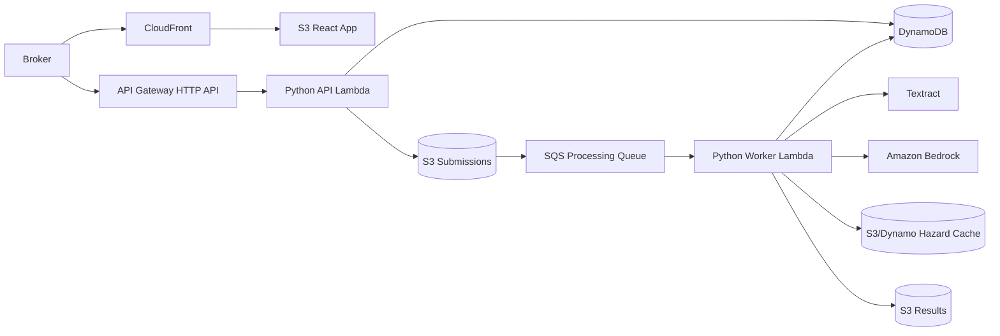
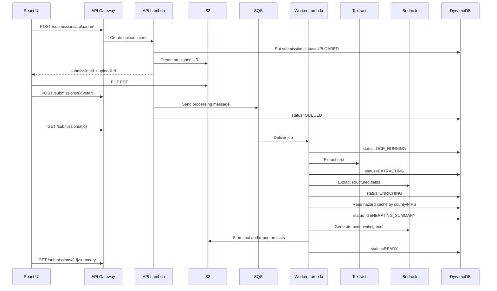

# Architecture

## High-Level Design

RiskLens uses a fast synchronous API for browser interactions and an asynchronous backend for expensive work such as OCR, data enrichment, and Bedrock calls.

## Runtime Flow

## Core Components

- React frontend: upload, progress, triage dashboard, and result review.
- API Lambda: low-latency request handling, auth checks, presigned URLs, status reads.
- Worker Lambda: asynchronous OCR, extraction, enrichment, and GenAI generation.
- DynamoDB: source of truth for submission metadata and status transitions.
- S3: raw uploads, extracted text, generated reports, cached public datasets.
- SQS: decouples frontend and backend processing; supports retry and DLQ handling.
- Bedrock: structured extraction and underwriting brief generation.
- Textract: OCR for PDFs/images. Text-native PDFs can use lightweight local parsing first to reduce cost.

## Latency Strategy

- Browser upload uses S3 presigned URLs, avoiding API Gateway payload bottlenecks.
- API calls return small JSON payloads and avoid OCR/LLM work.
- Long work is pushed to SQS and processed asynchronously.
- Frontend polls status every 2-5 seconds with exponential backoff after 60 seconds.
- Generated reports are loaded only when the status is `READY`.

## Scalability Strategy

- SQS absorbs traffic spikes.
- Worker Lambda concurrency is capped to control cost.
- DynamoDB uses on-demand capacity for unpredictable MVP traffic.
- Public datasets are cached in S3/DynamoDB rather than fetched per submission.
- The design can later split extraction, enrichment, and summary generation into separate queues if throughput requires it.

## Failure Handling

- Failed worker jobs retry through SQS redrive policy.
- Poison messages go to a DLQ after the configured retry count.
- Submission status changes to `FAILED` only after retries are exhausted or a non-retryable validation failure occurs.
- `NEEDS_REVIEW` is used when the document processes but required fields such as address or occupancy are missing.

